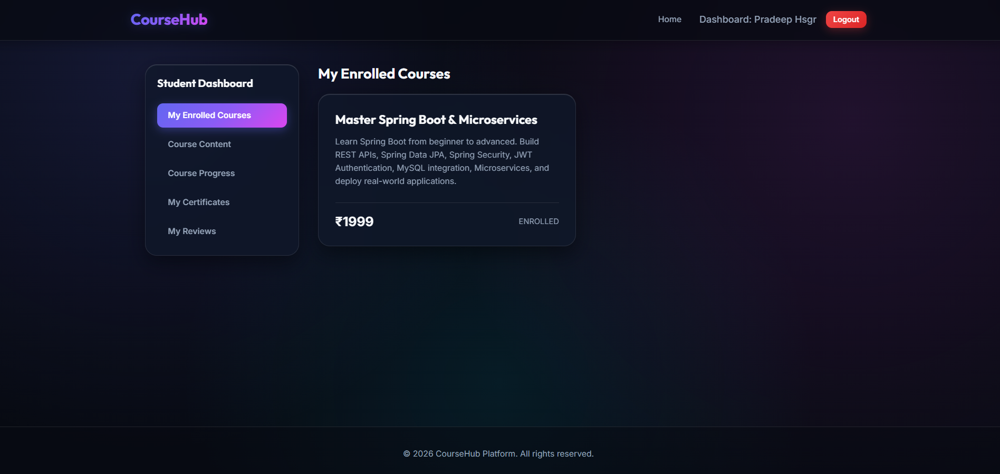
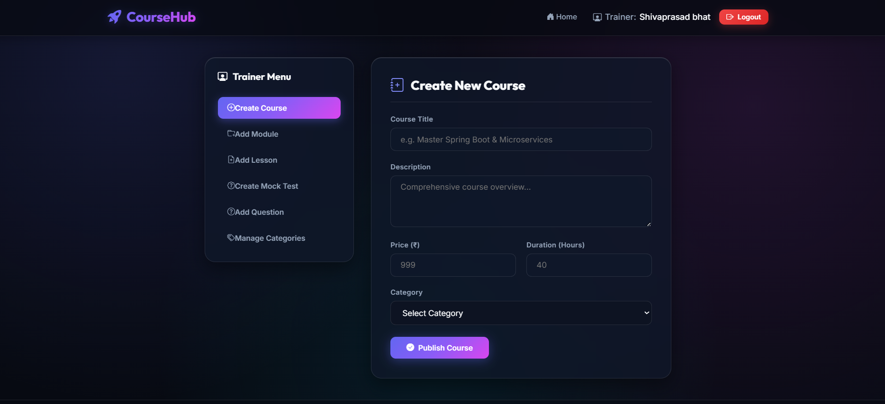
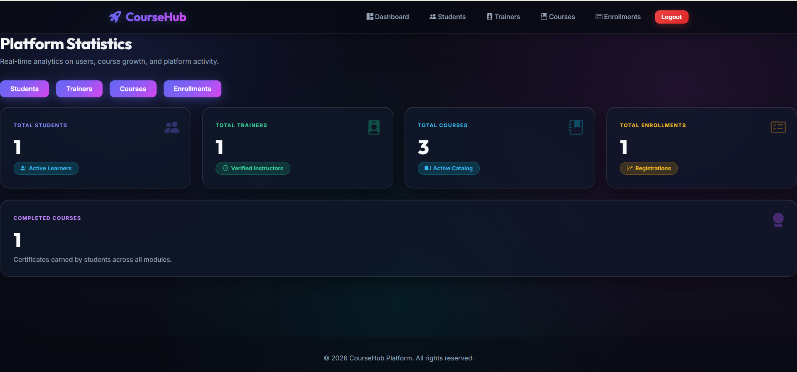

# 🎓 Course Ventures

A Full Stack Learning Management System (LMS) built using **Spring Boot, Spring Security, Thymeleaf, MySQL, and Razorpay**. The platform allows students to enroll in courses, trainers to manage content, and administrators to manage the entire system.

🌐 **Live Demo:** https://course-ventures.onrender.com

---

# 📸 Screenshots

> Add screenshots here after deployment.

| Home | Student Dashboard |
|------|-------------------|
|  |  |

| Trainer Dashboard | Admin Dashboard |
|-------------------|-----------------|
|  |  |

# 🚀 Features

## 👨‍🎓 Student

- User Registration
- Login & Logout
- Email OTP Verification
- Browse Available Courses
- Course Enrollment
- Secure Online Payment (Razorpay)
- View Purchased Courses
- Track Progress
- Take Mock Tests
- Download Certificates
- Edit Profile

---

## 👨‍🏫 Trainer

- Trainer Registration
- Approval by Admin
- Login
- Create Courses
- Upload Course Modules
- Manage Lessons
- Create Mock Tests
- View Student Enrollments
- Update Course Details

---

## 👨‍💼 Admin

- Secure Admin Login
- Dashboard Analytics
- Manage Students
- Manage Trainers
- Approve/Reject Trainers
- Manage Courses
- Manage Enrollments
- View Payments
- Platform Management

---

# 🛠️ Tech Stack

## Backend

- Java 21
- Spring Boot 3
- Spring Security
- Spring MVC
- Spring Data JPA
- Hibernate
- Thymeleaf

## Frontend

- HTML5
- CSS3
- JavaScript
- Bootstrap
- Thymeleaf Templates

## Database

- MySQL

## Payment Gateway

- Razorpay

## Mail Service

- Spring Mail
- Gmail SMTP

## API Documentation

- Swagger OpenAPI

## Build Tool

- Maven

## Deployment

- Render
- Railway MySQL

---

# 📂 Project Structure

```
Course Ventures
│
├── src
│   ├── main
│   │   ├── java
│   │   │   ├── controller
│   │   │   ├── service
│   │   │   ├── repository
│   │   │   ├── entity
│   │   │   ├── dto
│   │   │   ├── config
│   │   │   ├── exception
│   │   │   └── enums
│   │   │
│   │   └── resources
│   │       ├── static
│   │       ├── templates
│   │       └── application.properties
│
├── pom.xml
├── Dockerfile
└── README.md
```

---

# 🔐 Authentication

- Spring Security Authentication
- Role Based Authorization

### Roles

- ADMIN
- TRAINER
- STUDENT

---

# 💳 Payment Integration

The application integrates **Razorpay** for secure online payments.

Features include:

- Payment Creation
- Payment Verification
- Enrollment After Successful Payment

---

# ✉️ Email Features

- OTP Verification
- Registration Confirmation
- Password Reset

---

# 📚 Main Modules

- Authentication
- Student Management
- Trainer Management
- Course Management
- Enrollment Management
- Payment Module
- Mock Test Module
- Certificate Module
- Dashboard Module

---

# ⚙️ Installation

## Clone Repository

```bash
git clone https://github.com/pradeep-bhat-ms/course-ventures.git
```

```bash
cd course-ventures
```

---

## Configure Environment Variables

```
MYSQLHOST=
MYSQLPORT=
MYSQLDATABASE=
MYSQLUSER=
MYSQLPASSWORD=

MAIL_USERNAME=
MAIL_PASSWORD=

RAZORPAY_KEY=
RAZORPAY_SECRET=
```

---

## Build

```bash
mvn clean install
```

---

## Run

```bash
mvn spring-boot:run
```

---

# 🌍 Deployment

Backend deployed on **Render**

Database hosted on **Railway MySQL**

---

# 📄 API Documentation

```
http://localhost:8080/swagger-ui/index.html
```

After deployment

```
https://course-ventures.onrender.com/swagger-ui/index.html
```

---

# 🧪 Testing

Run tests

```bash
mvn test
```

---

# 📈 Future Enhancements

- AI Course Recommendation
- Live Classes
- Video Streaming
- Discussion Forum
- Course Reviews
- Wishlist
- Coupon System
- Notifications
- Mobile Application
- Analytics Dashboard

---

# 👨‍💻 Author

**Pradeep Bhat M S**

Java Full Stack Developer

GitHub:
https://github.com/pradeep-bhat-ms

LinkedIn:
https://www.linkedin.com/in/pradeep-bhat-ms

---

# ⭐ Support

If you found this project useful, please consider giving it a ⭐ on GitHub.

---

# 📜 License

This project is licensed under the MIT License.
